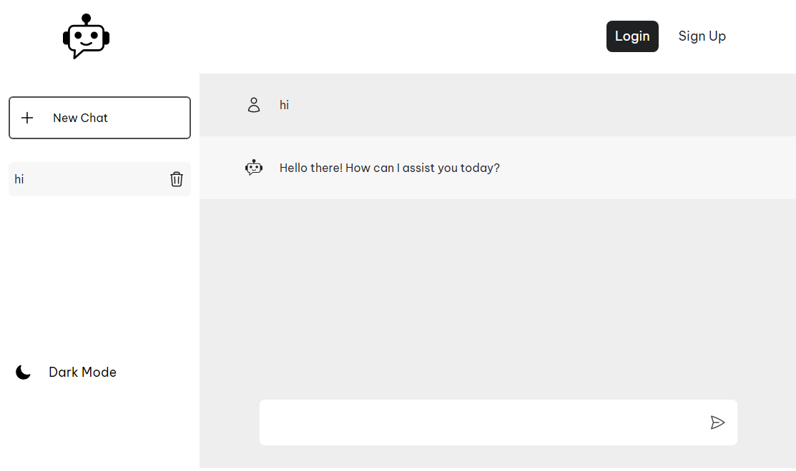
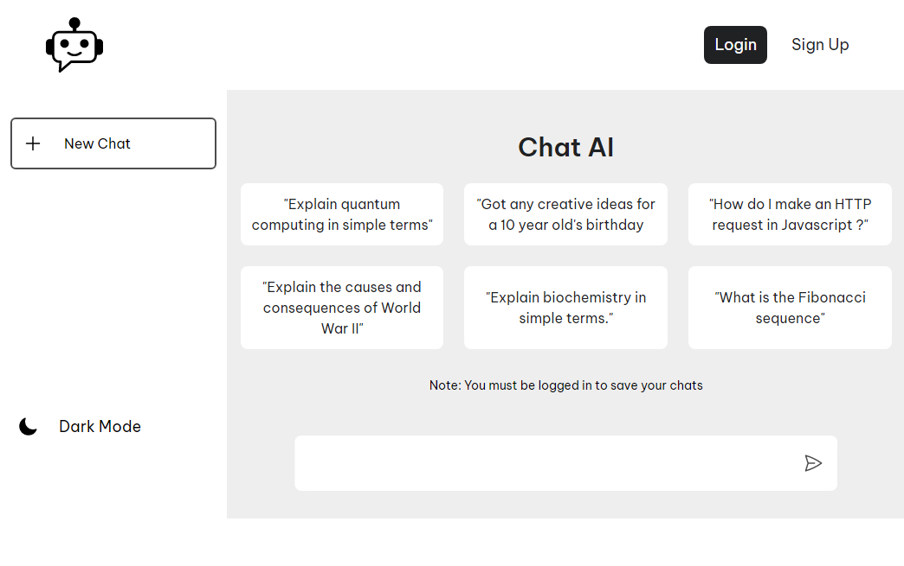
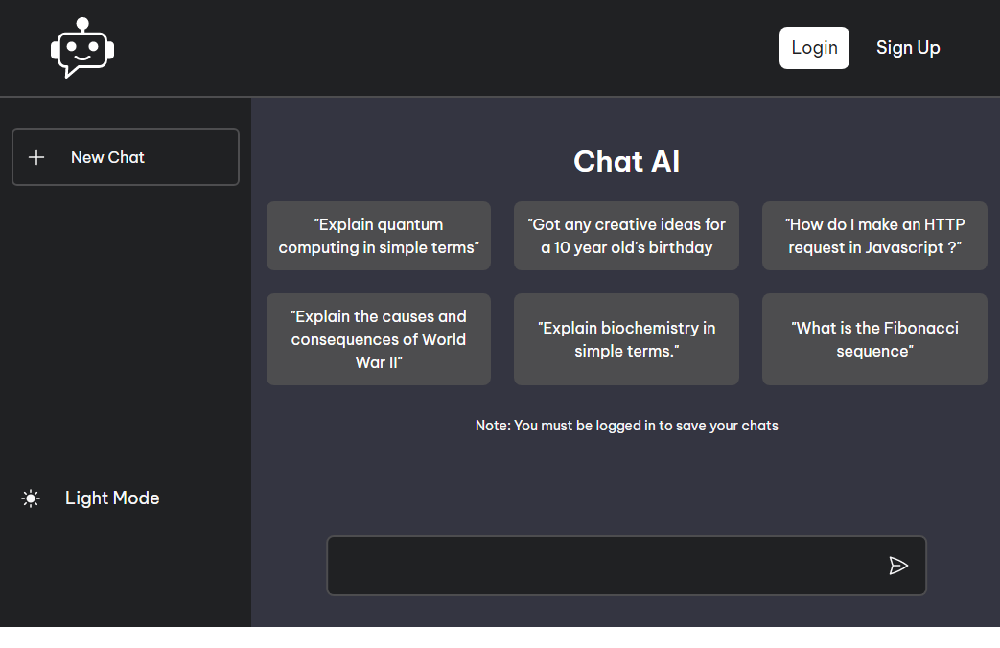
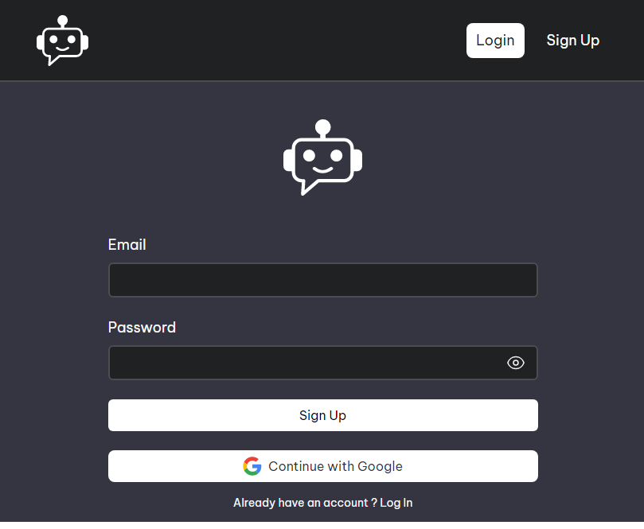

# Chat AI
AI Chatbot web application built with React.js and Google Gemini API

## Features
- Users can save their chats to database using Firestore.
- Light and dark themes.
- Chats management using Firestore.
- User Authentication using Firebase Authentication

## Tech Stack
- React.js
- Vite
- Tailwindcss
- Firebase Cloud Firestore
- Firebase Authentication
- Vitest
- react-router

## Demo
Live Demo: (https://chataigemini.netlify.app/)